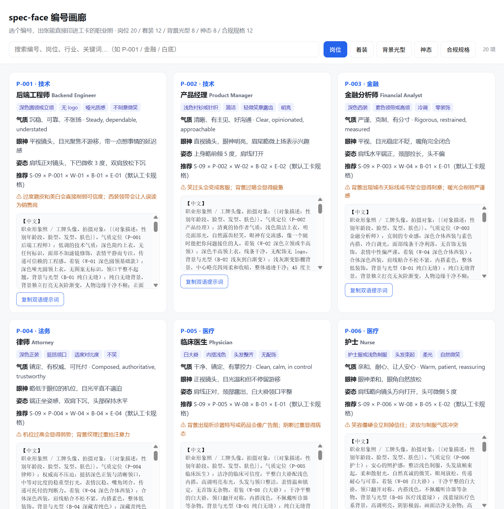

<p align="center">
  <strong>中文</strong> | <a href="README_en.md">English</a>
</p>

# spec-face · 工牌头像编号库与合规规格提示词

> **不会描述职业气质？搞不清证件规格？选个编号，出张能直接印进工卡的职业照。**

这里整理了 **20 种岗位气质**（P）、**12 种着装仪容**（W）、**8 种背景与光型**（B）、**8 种神态表情**（E），以及最关键的 **12 套合规规格**（S）——一寸二寸、CR80 工卡、申根美签、企业 IM 圆裁头像、门禁人脸库，每套都写清了尺寸、DPI、头部占比、瞳孔线位置、底色 RGB 与体积上限。外加 **6 种打印载体**（T）：从 6 寸相纸到 PVC 卡面，能排几张是算出来的，不是"一般排 8 张"这种经验数字。v0.3.0 起还有 **6 个生成后端**（G）——你把本人照片交给**自己机器上**的 ComfyUI / SD WebUI / PhotoMaker 出图，工具不托管、不代跑、不上传。

你不需要背"伦勃朗光""头高占画面 70%"这类术语，也不需要记住各国的细则差异。**选定规格号 + 岗位号，说一句"这个人长什么样"，就能拿到经过结构化的中英双语生图提示词，再本地跑一次校验，看这张图到底能不能用。一个人是这样，两百个人也是一条命令。**

> ### 👉 不想装环境？[**在线试用台**](https://shixingya.github.io/spec-face/) 直接选编号出提示词
>
> 选规格 → 挑岗位 → 拖照片本地校验，全部在浏览器里跑完，**图片不上传、不经过任何服务器**。生图仍需本机 Python + GPU，网页不代跑。

<div align="center">



</div>

---

## 为什么做这个

AI 写真工具满地都是，但它们大多数在解决同一件事：**把人变好看**。

工牌不是。工牌要解决的是另外三件事，而且顺序不能颠倒：

1. **能不能过规格** —— 头部占比差 5%，签证被退；底色偏一点，重拍；忘转 CMYK，印出来变色
2. **还像不像本人** —— 磨皮瘦脸放大眼睛之后，同事认不出，闸机也认不出
3. **一批人齐不齐** —— 500 个门店员工，光型背景各不相同，一眼就是拼凑的

这三件事没有一件靠"更美的提示词"解决，它们靠**规格、约束和校验**。这就是 `spec-face` 和普通写真提示词库的全部区别，也是我们把名字里那个 `spec` 放在最前面的原因。

## 它解决了什么

| 你的痛点 | spec-face 的做法 |
| :-- | :-- |
| 不知道岗位该是什么气质 | **20 个岗位编号**，连眼神和姿态都写死，"像个干这行的人"不再靠玄学 |
| 生成完不像本人 | 提示词内置**身份保真红线**：禁止磨皮瘦脸改五官，宁可素净不可失真 |
| 尺寸、底色、占比总返工 | **12 套规格库**给出可校验的数值目标，附交付前自检清单 |
| 不知道哪个模型靠谱 | `identity_matrix.json` 记录各模型身份保真实测表现（v1 待测，见下文） |
| 一批人做出来参差不齐 | `--locked` 批量锁定模式，五元编号固定，禁止逐次改词 |
| 换模型就得重写提示词 | 中英双语分段，五层编号可自由组合复用 |
| 200 号员工的花名册要逐条出词 | `batch_roster.py` 读 CSV，认编号、补默认、查冲突，一次出全套提示词 + 复核表 |
| 同一批里有人笑有人不笑 | 批次一致性体检：`S-09` 这类"岗位统一"规格会直接告诉你哪个维度散了 |
| 送印被退回：偏色、尺寸差、裁切留白边 | `print_export.py` 按 mm×dpi 反算像素，同时给 RGB 冲印稿与 CMYK 印刷稿，出血用边缘像素补齐 |
| 小尺寸头像被圆形裁掉耳朵 | `guide_overlay.py` 把瞳孔线带、头部高度框、70% 圆形安全区画在图上 |
| 手里有一张照片，想直接做成头像而不是拿提示词 | `gen_portrait.py` / `studio.py` 走本机开源服务出图，出完自动回校验 |
| 不敢把人像传给云端 | 默认只连 127.0.0.1，改云端要你自己写 `--allow-remote` |
| 装环境之前先想看看长什么样 | [**在线试用台**](https://shixingya.github.io/spec-face/)：浏览器里选号出词 + 拖图校验，图片不出本机 |

## 快速开始

### 0. 安装依赖

```bash
pip install pillow                # 规格校验必需
pip install opencv-python         # 可选：自动估算头部占比
```

### 1. 挑编号，出提示词

```bash
python scripts/prompt_spec.py --spec S-09 --persona P-001 \
  --subject "30岁男性，方脸，短寸发，自然肤色" \
  --subject-en "30-year-old man, square face, buzz cut, natural skin tone"
```

`--wear / --backdrop / --mood` 不用填，脚本会按岗位推荐组合自动补全，并告诉你为什么。

输出长这样（节选）：

```
组合  S-09 × P-001 × W-01 × B-01 × E-01
规格  企业工卡头像区（CR80） · 300×375px · 300dpi · 白底或企业 VI 色（转 B-08）

【中文提示词】
职业形象照 / 工牌头像。拍摄对象：30岁男性，方脸，短寸发，自然肤色。
气质定位（P-001 后端工程师）：低调的技术气质：深色简约上衣，无任何标识……
构图与规格（S-09，300×375px / 300dpi / 白底）：头部高度占画面 65%–78%；
瞳孔线位于画面底部起 52%–66% 之间……
身份保真是唯一通过条件：以上传的参考照片作为人脸的唯一来源，
禁止磨皮、瘦脸、放大眼睛、改变五官比例与肤色基调；宁可素净，不可失真。

【交付前自检清单】
  [ ] 头部高度占比 65%–78%
  [ ] 文件大小上限 800KB，格式 jpg/png
  [ ] 岗位易翻车点：过度磨皮和美白会直接削弱可信度；西装领带会让人误读为销售岗
```

把成图丢进 Midjourney、GPT-Image、Nano Banana、即梦、Flux、ComfyUI 都能用。手里有本人照片、想让图在自己机器上长出来，跳到下面「从照片到成图」一节走 `gen_portrait.py`。

### 2. 出图之后，本地校验

手上还没有成图？仓库自带一张示例头像 `images/sample-headshot.jpg`（由本项目提示词生成的 AI 人像，右下角带生成标识，不是真人照片），下面的命令可以直接复制执行：

```bash
python scripts/check_spec.py images/sample-headshot.jpg --spec S-01
python scripts/check_spec.py 成图/*.jpg --spec S-11 --json     # 批量
```

```
规格 S-01 一寸照  目标 [295, 413]  300dpi  白底
⚠ 本规格 needs_verification：正式提交前请比对受理方最新公告
----------------------------------------------------------------

images/sample-headshot.jpg
  [✓] format       实际 .jpg，允许 jpg/png
  [✓] max_kb       实际 91.2KB，上限 300KB
  [✗] px           实际 768×1024，目标 295×413（±2%）
  [✗] aspect       实际 1:0.75，目标 1:0.714
  [-] dpi          图片无 DPI 元数据；印刷用途请由导出工具写入，而非只改像素数
  [✗] bg_color     背景取样中位色 rgb(239, 239, 240)（顶边+侧边上部），目标 rgb(255, 255, 255)±12，最大偏差 16
  [-] head_ratio   未安装 opencv-python；头部占比 62%–72% 需目视确认
  [-] eye_line     同上

3 项跳过：本工具不谎报通过。人工目视确认后再交付。
```

这张示例图**故意没过校验**：尺寸是模型出的原始尺寸、底色偏灰 16 个单位。它正好演示了校验器存在的意义——"看起来挺白的"不算，量出来 239 就是 239。按 `S-01` 目标像素重出图、或走 `print_export.py` 排版导出，才是交付件。

**图片全程留在本机，不上传任何地方。** 校验器只报告它能客观判定的项——判不了的就标 `SKIP`，不会假装通过。

### 3. 上面这两步，浏览器里也有一份

不想装 Python：**[shixingya.github.io/spec-face](https://shixingya.github.io/spec-face/)** 把「挑编号出提示词」和「拖图片本地校验」都搬到了网页里。提示词拼装是 `prompt_spec.py --json` 的逐句 JS 移植，两边输出的 SHA-256 实测一致；背景取样沿用 `check_spec.py` 的口径——顶边 + 侧边上部、逐通道中位数，不是整圈均值。

浏览器给不了的两项一律标 `−` 而不是假装通过：网页里的图片没有 DPI 元数据，也不做人脸检测。拖进去的照片在你自己的浏览器里解码，页面不发任何上传请求。源码在 `docs/`，由 `python scripts/build_site.py` 从 `references/*.json` 重新生成。

## 编号体系：五层出词 + 交付与生成

| 前缀 | 含义 | 数量 | 决定什么 |
| :-- | :-- | :-- | :-- |
| `S` | 合规规格 | 12 | 尺寸、DPI、头部占比、瞳孔线、底色、体积 —— **先定这个** |
| `P` | 岗位气质 | 20 | 像个干这行的人：眼神、姿态、气质、易翻车点 |
| `W` | 着装仪容 | 12 | 穿什么：白大褂、工服、挺括衬衫、深色西装 |
| `B` | 背景光型 | 8 | 在什么环境、什么光，含可校验目标色 |
| `E` | 神态表情 | 8 | 什么表情，含微笑幅度数值（批量一致性用） |
| `T` | 打印载体 | 6 | 落在什么介质上：5/6/7/8 寸相纸、A4、CR80 卡面 |
| `G` | 生成后端 | 6 | 这图由谁画：本机 ComfyUI+PuLID / InstantID、SD WebUI+IP-Adapter、PhotoMaker 配方、OpenAI 兼容接口、纯导出 |

图鉴直接看：[PERSONAS.md](PERSONAS.md)（P/W/B/E）· [SPECS.md](SPECS.md)（S）
不想开终端就双击打开 [`skills/portrait-prompter/gallery/index.html`](skills/portrait-prompter/gallery/index.html)——离线单页，可检索，一键复制双语提示词。

<div align="center">


*规格标签页：底色目标值、头部占比、瞳孔线、体积上限，全部是可校验的数字，不是形容词。*

</div>

## 五种用法

**① 零门槛**：不想翻图鉴就直接说需求。

> 给门店新员工做一套工牌头像，亲和一点

Skill 会选 `P-018 连锁门店员工` + `S-09`，并解释理由。

**② 精准指定**：你已经知道要什么。

> 图型 S-07，岗位 P-005，神态 E-01，对象：28岁女性，齐肩发

**③ 照片出成图**：你手里有一张本人照片，要的是能直接用的头像，不是提示词。

```bash
python scripts/gen_portrait.py --photo 我的照片.jpg --spec S-09 --persona P-001 \
  --subject "30岁男性，方脸，短寸发" --provider G-01 \
  --workflow 我的工作流.json --confirm-authorized 本人
```

详细链路与三道闸门见下面「从照片到成图」一节。

**④ 批量锁定**（团队场景）：一批人必须齐。

```bash
python scripts/prompt_spec.py --locked \
  --spec S-09 --persona P-018 --wear W-09 --backdrop B-01 --mood E-02 \
  --subject "员工编号 0341 + 客观外貌描述"
```

`--locked` 会拒绝任何缺省补全，五元编号必须写全，保证这批图的措辞完全一致。批量场景请避开 `B-07`（办公室虚化，环境光无法统一）；要品牌底色就用 `B-08` 并先向客户索取 VI 的 RGB。

**⑤ 整批交付**（这才是收钱的那一层）：HR 给你一张 Excel，你要的是当天交差。

```bash
python scripts/batch_roster.py --template out/roster.csv    # 先拿模板
python scripts/batch_roster.py out/roster.csv --out out/batch
```

```
花名册 out/roster.csv：3 行 → 3 人可出图，0 行待补
  S-09 企业工卡头像区（CR80）：2 人
  S-11 企业 IM 头像（飞书/企微/钉钉）：1 人
一致性提醒：
  ! 着装：表内未填，按岗位默认补全：仓库与产线→W-09（王强）；门店店长→W-06（李静）
  ! S-09 企业工卡头像区（CR80）：wear 在 2 人批次里出现 2 种（W-09×1、W-06×1）：
    该规格要求岗位统一，建议取 W-09 后重出
```

岗位列写 `P-018` 也行，写 HR 嘴里的「仓储主管」「置业顾问」它也能认（认不准就报错列出候选，绝不猜）。
输出：每人一份可直接粘贴的双语提示词、`prompts.jsonl`、`review.html` 复核表、`batch_manifest.json`。
整批锁风格加 `--uniform --wear W-09 --backdrop B-01 --mood E-02`，表里写歪的那一行会被拦下来而不是混进成品。

## 从照片到成图：把脸交给你自己机器上的开源服务

提示词只是半成品。多数人真正想要的是：**我这张照片，变成一张能印进工卡的头像。**

v0.3.0 加了 G 层（生成后端）。它不训练模型、不托管推理、不代跑，也不把照片传给任何人——它是一层协议适配 + 合规闸门，把你本机的开源服务接进这条流水线：

```
照片 → 按规格居中裁切、EXIF 转正 → 组装提示词 → 身份注入请求 → 本机服务出图
     → 自动跑 check_spec.py → 写 render_manifest.json（谁授权、哪个后端、哪些项没过）
```

```bash
python scripts/gen_portrait.py --list-providers        # G-01~ 各要什么：协议/显存/许可/坑
python scripts/gen_portrait.py --scan ./相册            # 列候选照片，按编号选
python scripts/gen_portrait.py --photo 我的照片.jpg --spec S-09 --persona P-001 \
  --subject "30岁男性，方脸，短寸发" --provider G-01 \
  --workflow 我的工作流.json --confirm-authorized 本人 --n 3
python scripts/gen_portrait.py --probe http://127.0.0.1:8188   # 服务在不在，三种协议挨个试
```

真实输出（`G-06` 纯导出档，机器上没有 GPU 时的默认落点）：

```
组合  S-01 × P-001 × W-01 × B-01 × E-01
后端  G-06 只导出提示词与请求体（离线手工） · payload · 状态 verified
参考  images/sample-headshot.jpg → reference_sample_headshot.png [731, 1024]
目标  295×413px，生成用 296×416（就近取 8 的倍数）  种子 545173620  候选 3 张
· 按 S-01 的 1:0.714 居中裁切，丢弃 5% 画面
· --wear 缺省，按「后端工程师」推荐 W-01 深色圆领基础款

[dry-run / 该后端不代跑] 到此为止，没有发起任何请求。
产物目录：out\render\S-01_G-06_20260929-175641
```

产物目录里是 `prompt_zh.txt / prompt_en.txt / negative.txt / request.json|workflow.json / render_manifest.json`，扔进任何一台有卡的机器都能跑。

### 三道闸门是代码，不是"建议"

这是本项目唯一允许"工具替你说 No"的地方：

1. **没有照片就不跑。** 只想凭文字生成一个不存在的人，那是写真需求，请回 `prompt_spec.py`。
2. **必须写明授权。** `--confirm-authorized` 缺失即拒跑，并且拒绝一切"用生成的照片去过门禁 / 活体检测 / 实名认证"的用法。
3. **没有身份注入就不跑。** 请求体里找不到 PuLID / InstantID / IP-Adapter / ReActor 一类节点，直接拦下——没有身份注入的文生图必然画出"更好看但不是本人"的人，而"像不像本人"是工牌头像唯一的通过条件：

```
· 未给 --payload-extra：请求体里没有身份注入扩展的参数，WebUI 多半直接文生图——那必然不像本人。
请求体已写出：out\render\S-01_G-03_20260929-175655\request.json
拒跑：请求体里找不到任何身份注入节点/扩展（关键词：pulid、instantid、photomaker、ipadapter…）。
两条路：① 按上面的提示给出 --workflow / --payload-extra；② 确实只做背景与着装重绘，加 --allow-no-identity。
```

第三条最容易被绕过，所以它做成了检查而不是文档：**你没法用这个工具生成一张"不认识的人"的证件照**，除非你明写 `--allow-no-identity` 并接受它不再叫身份照。

### 默认只连 127.0.0.1

端点非回环地址会被直接拒绝，除非你自己加 `--allow-remote`。因为把 `--endpoint` 换成公网地址，等于把人脸上传到别人的服务器——这件事必须由操作的人明确承担，不能由工具的默认值替他决定。

### 不想敲命令：本机工作台

```bash
python scripts/studio.py --dir ./相册      # 只监听 127.0.0.1:8765
```

浏览器里左边选照片，中间挑 `S/P/W/B/E` 编号并实时画构图辅助线，右边选后端、按授权勾选、点生成，出图卡片下面直接挂着规格校验结果。工作台只允许访问你指定的照片目录与 `out/`，路径穿越一律 403。

### 关于诚实

`providers.json` 里 G-01~G-05 的状态全是 `unverified`——**本仓库从未在任何真实 GPU 上跑通过这条链路**，只保证协议形状（端点、字段、上传与轮询流程）经过本地假服务端到端验证，以及合规闸门生效。唯一标 `verified` 的 G-06 只做本地导出，不发网络请求。

这条规矩由 `validate_library.py` 强制：`status: verified` 却没有 `evidence` 字段，校验直接失败。我们没有拿"看起来能跑"冒充"跑过"。

## 印刷交付：从"图不错"到"能过打印店"


```bash
python scripts/print_export.py --list-papers
python scripts/print_export.py 成图/*.jpg --spec S-01 --paper T-02 --cut-marks --out out/print
python scripts/print_export.py 成图/*.jpg --spec S-09 --paper T-06 --cmyk      # 卡厂要的那份
```

```
纸张 T-02 6寸相纸（4R）：101.6×152.4mm = 1200×1800px @ 300dpi
单元 S-01 一寸照 的整张照片：25×35mm → 295×413px；出血 0mm，间距 2mm，留白 3mm
可排 3×4 = 12 张/版
  ✓ sheet-01：8/12 格  → out/print/S-01_T-02_sheet-01.jpg
  ! c.jpg: 原图 400×400px 需放大 4.00 倍才够 1181×1654px，冲印出来会糊；建议按本规格目标像素重新出图
```

它同时解决打印店返工的全部三个原因：**尺寸**（按 mm×dpi 反算，不靠猜）、**偏色**（RGB 冲印稿与 CMYK 印刷稿一起给，并说明各交给谁）、**裁切留白边**（出血用边缘像素复制补齐）。
证件照默认**绝不旋转**去凑排版——横过来的人像冲出来是躺着的，要真需要再加 `--allow-rotate`。

想知道"差在哪"而不只是"过没过"，用辅助线预览：

```bash
python scripts/guide_overlay.py 成图.jpg --spec S-11
```

<div align="center">


*左：一寸照的瞳孔线带、头部高度框、背景取色区。右：企业 IM 头像的 70% 圆形安全区——耳朵和肩线就是在这被切掉的。示例头像是本项目的提示词生成的 AI 人像（右下角带生成标识），不使用任何真人照片。*

</div>

## 装成 Agent Skill

把仓库地址发给 Codex / Claude Code：

> 帮我安装这个 Skill：https://github.com/shixingya/spec-face
> Skill 定义在 `skills/portrait-prompter/SKILL.md`

装好后可以直接说"我要给 40 个店员做门禁头像"，Agent 会自己走**定规格 → 选岗位 → 组装 → 批量锁定 → 交给本机开源服务出图 → 本地校验**这条链路，并且在三种情况下拒绝你：照片不是你的、请求里没有身份注入、你想拿这张图去过闸机。

## 关于 identity_matrix：这是全项目最值钱也最空的一块

`references/identity_matrix.json` 定义了六个评测维度——**身份保真度 / 规格可达性 / 美颜漂移 / 批次一致性 / 失败模式**，以及一套可复现的盲测流程（8 位志愿者、每人 3 张原生照、每模型跑 5 次、三人盲评是否同一人、人脸 embedding 相似度报均值与 P10）。

**但 v1 里所有分数都是 `null`。** 因为我还没有做真人实测。

我没有编一组看起来很像真的数字填进去——那份数据看起来会更成熟，但它会误导每一个拿它选模型的人，也会让这个项目最核心的卖点变成假的。

所以这块现在是骨架 + 方法论 + 空表格，等你我他一起做实测。**这是本项目唯一的壁垒，也是它值得长期维护的原因**：模型每月都在变，身份保真度的真实排名必须有人每月重测一次。做完了这件事，你手里就有一份别人抄不走的数据。

v0.2.0 起，测这一轮需要的东西都齐了，不用自己从零设计：

- [`research/README.md`](research/README.md) —— 盲测协议：最低样本门槛、七步流程、打分列定义、以及五种会让数据作废的作弊方式
- [`research/consent-form.md`](research/consent-form.md) —— 肖像授权书模板：授权范围、明确不授权的事项、保留期限、7 日撤回权
- [`research/score-sheet-template.csv`](research/score-sheet-template.csv) —— 打分表模板
- `scripts/score_matrix.py` —— 聚合入库，**并且拒绝没有证据的结论**

```bash
python scripts/score_matrix.py 我的实测.csv --dry-run
python scripts/score_matrix.py 我的实测.csv --evidence "issue#12" --write
```

样本不足、没写模型版本号、没给可复核证据——`--write` 也只会跳过并告诉你缺哪一条。
`validate_library.py` 会拦住 `tested: true` 却缺分数、缺样本量、缺证据的条目。
矩阵里出现假数字，整个项目的卖点就没了，所以这道门比功能本身更重要。

## 贡献

改 `references/*.json` 加编号，然后三连：

```bash
python scripts/validate_library.py    # 字段、编号、交叉引用、数值合理性
python scripts/build_gallery.py       # 重建离线画廊
python scripts/build_docs.py          # 重建 PERSONAS.md / SPECS.md
```

校验器会拦住编号重复、`aspect` 与 `px` 对不上、给了 `bg_rgb` 却没给容差、以及 `tested: true` 但分数为空这类**虚假声明**。

欢迎提 PR：新岗位、新规格、以及**任何带方法论的实测数据**。

每一版改了什么、哪些能力仍标着"未实测"，都写在 [CHANGELOG.md](CHANGELOG.md) 里。

## 开源与商业的边界

这个项目是要赚钱的，所以把话说在前面。完整价目与交付口径见 [COMMERCIAL.md](COMMERCIAL.md)。

- **永久免费（MIT）**：全部编号库（P/W/B/E/S/T/G）、双语提示词、本机开源服务出图链路与三道闸门、规格知识、本地校验、批量出词与排版导出、离线画廊、Agent Skill、盲测协议与授权书模板。知识部分公开到位，你照着做一家公司的工牌完全够用。
- **收费部分**：真人代跑（你给花名册，我交出片）、企业 VI 色与定制工装编号包、规格包月度更新订阅、门禁/IM 对接、私有化部署（在你的内网把 G 层链路搭通、把工作流调到出片达标）、以及 identity_matrix 的季度复测报告。
- 判断标准一句话：**知识全免费，重复劳动收费。** 你能免费拿到"怎么做"，付费买的是"两百家门店、下周三之前做完"。

## 合规声明（请认真读）

- 人脸是敏感个人信息。本项目默认全本地运行，不收集、不上传、不存储任何照片；生成后端只连 127.0.0.1，接云端要你自己写下 `--allow-remote` 并承担这次上传。
- **只处理本人或已获书面授权的对象。** 未经授权的换脸可能构成侵权，用于身份认证场景可能触犯法律。`--confirm-authorized` 不是走形式，缺了工具就不跑。
- **不得用于绕过人脸识别、活体检测或实名认证。** 项目文档、Skill 与 `gen_portrait.py` 三层都会拒绝此类请求。
- 涉及签证、护照、驾照等官方证件：本项目只提供**规格参考**，不承诺可通过。多数国家目前不接受 AI 生成的证件照，办理前请向受理机构确认。
- 建议为成图写入 AI 生成标识（C2PA 内容凭证，或可见/不可见水印）。

## 路线图

- [ ] `identity_matrix.json` 首轮真人实测（3 个模型 × 8 位志愿者）——协议、授权书、聚合脚本已就位（v0.2.0），缺的就是跑
- [ ] 岗位库扩到 40 个，补齐医护、制造、政企窗口
- [ ] `check_spec.py` 接入人脸关键点，把头部占比与瞳孔线从 `SKIP` 变成实测
- [x] 导出印刷文件：CMYK 转换 + 出血 + 相纸多联排版（`print_export.py`，v0.2.0）
- [x] 圆形安全区预览（`guide_overlay.py`，v0.2.0）
- [x] 花名册批量出词与一致性体检（`batch_roster.py`，v0.2.0）
- [x] 生成后端 G 层：本人照片 → 本机开源服务出图 → 自动回校验，含工作台页面（`gen_portrait.py` / `studio.py`，v0.3.0）
- [x] 在线试用站 <https://shixingya.github.io/spec-face/>：选号出词 + 拖图校验，纯静态、图片不出浏览器（v0.4.0）
- [ ] 试用站改为 push 到 main 后自动发布，去掉手工拷贝 `docs/` → `gh-pages` 这一步
- [ ] **在真实 GPU 上把 G-01/G-03 跑通**，回填 `providers.json` 的 `evidence` 与 `identity_matrix` 首行数据——目前它们诚实地标着 `unverified`
- [ ] `studio.py` 支持拖拽花名册，一整列人连着出图
- [ ] 规格官方来源逐条比对，去掉 `needs_verification` 标记
- [ ] `print_export.py` 输出带裁切口的 PDF/X-1a，供印刷厂直接拼版

## 作者

**卜天** —— 写了十年代码，也在听人说心里话。这个项目把两件事合在一起：工程的规格，和一个人想在职场上被怎样看见。

知乎 / CSDN / 公众号同名。想聊批量落地或企业内训，公众号后台回复「**咨询**」。

## License

[MIT](LICENSE)
