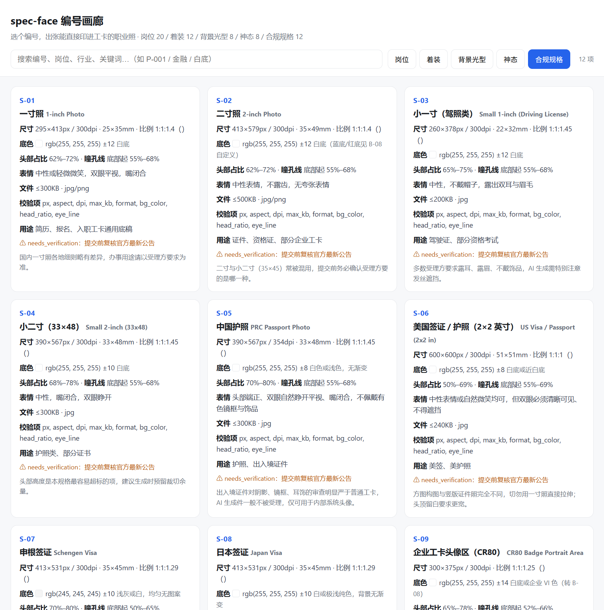
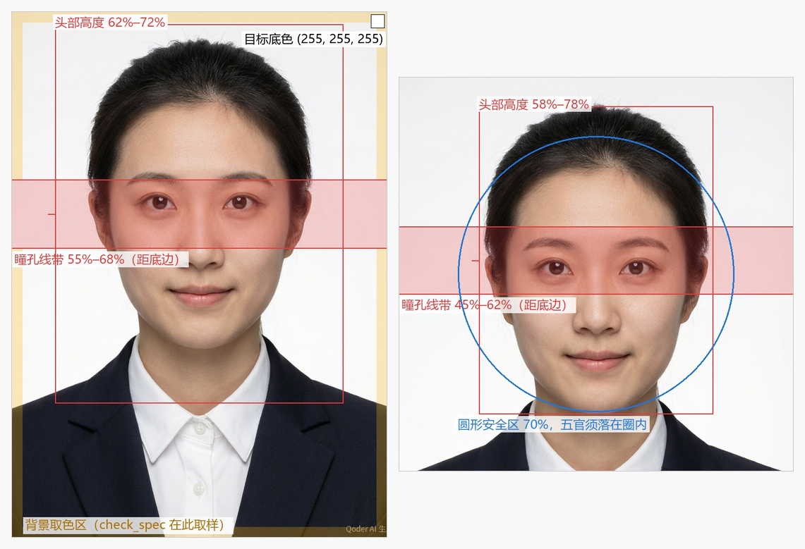

<p align="center">
  <a href="README.md">中文</a> | <strong>English</strong>
</p>

# spec-face · A numbered library for badge-ready professional headshots

> **Can't describe professional presence? Unsure about ID photo specs? Pick a number and get a headshot you can actually print on a badge.**

20 **persona styles** (P) · 12 **wardrobe codes** (W) · 8 **backdrop & lighting setups** (B) · 8 **expression codes** (E) — and, most importantly, 12 **compliance specs** (S): 1-inch/2-inch, CR80 badge portrait area, Schengen and US visa formats, circular-cropped enterprise IM avatars, access-control face enrollment. Every spec carries exact dimensions, DPI, head-height ratio, eye-line position, background RGB and file-size ceiling. Plus 6 **print carriers** (T): from 4R photo paper to a CR80 card face — how many portraits fit per sheet is computed, not folklore.

You don't need to memorize "Rembrandt lighting" or "head height must be 70% of frame". Pick a spec and a persona, describe the person, and you get a structured bilingual prompt — then run a local check to see whether the result actually passes. One person or two hundred: it's one command either way.

---

## Why this exists

AI headshot tools are everywhere, and nearly all of them solve the same problem: **making people look better**.

A badge photo is not that. A badge photo has to clear three other bars, in this order:

1. **Does it pass the spec** — head ratio off by 5% and the visa is rejected; background drifts and you reshoot; forget CMYK conversion and the print comes back the wrong color
2. **Does it still look like the person** — after skin smoothing, face slimming and eye enlargement, coworkers don't recognize them, and neither does the turnstile
3. **Is a batch consistent** — 500 store staff, each lit differently, reads as a pile of scraps

None of these are fixed by a prettier prompt. They are fixed by **specs, constraints and verification**. That is the entire difference between `spec-face` and a generic portrait prompt library — and the reason `spec` comes first in the name.

## What it solves

| Your problem | How spec-face handles it |
| :-- | :-- |
| No idea what a role should look like | **20 persona codes**, gaze and posture included |
| Generated face doesn't resemble the person | Identity fidelity is hard-wired into the prompt: no smoothing, no slimming, no proportion edits |
| Constant rework on size and background | **12 specs** with measurable targets plus a pre-delivery checklist |
| Don't know which model to trust | `identity_matrix.json` records measured identity fidelity per model |
| Batch output is inconsistent | `--locked` mode pins all five codes and refuses silent defaults |
| Rewriting prompts per model | Bilingual, segmented, every layer reusable |
| An HR spreadsheet of 200 names | `batch_roster.py` reads the CSV, resolves codes, fills defaults, flags conflicts, emits a review sheet |
| Some staff smile, some don't, same badge run | Batch consistency audit tells you which dimension drifted |
| Print shop rejects the file: color cast, wrong size, white edges | `print_export.py` computes px from mm×dpi, ships RGB and CMYK together, extends bleed by edge replication |
| Circular avatars clip the ears | `guide_overlay.py` draws the eye-line band, head box and 70% safe circle onto the photo |

## Quick start

```bash
pip install pillow                # required for spec checking
pip install opencv-python         # optional, estimates head ratio automatically

python scripts/prompt_spec.py --spec S-09 --persona P-001 \
  --subject "30-year-old man, square face, buzz cut, natural skin tone"
```

`--wear / --backdrop / --mood` are optional; the script fills them from the persona's recommended set and tells you why.

No headshot handy? The repo ships one: `images/sample-headshot.jpg`, an AI portrait rendered from this project's own prompts (watermarked, not a real person). These commands run as-is:

```bash
python scripts/check_spec.py images/sample-headshot.jpg --spec S-01
python scripts/check_spec.py shots/*.jpg --spec S-11 --json
```

```
Spec S-01 1-inch  target [295, 413]  300dpi  white background
⚠ needs_verification: confirm with the receiving authority before submitting
----------------------------------------------------------------

images/sample-headshot.jpg
  [✓] format       .jpg, allowed jpg/png
  [✓] max_kb       91.2KB, ceiling 300KB
  [✗] px           768×1024, target 295×413 (±2%)
  [✗] aspect       1:0.75, target 1:0.714
  [-] dpi          no DPI metadata; write it during export, don't fake it by resizing
  [✗] bg_color     sampled background median rgb(239, 239, 240) vs rgb(255, 255, 255)±12, worst delta 16
  [-] head_ratio   opencv-python not installed; 62%–72% needs visual confirmation
  [-] eye_line     same as above

3 checks skipped: this tool does not report a pass it did not measure.
```

That sample **fails on purpose**: it's the model's raw output size and its backdrop is 16 units off pure white. "Looks white" doesn't count — 239 is 239. Re-render at the spec's target pixels, or run it through `print_export.py`, before you deliver anything.

Anything the checker cannot measure is reported as `SKIP`, never as a pass. It will not lie to you. **Every check runs on your machine — no image is uploaded anywhere.**

## Five layers for prompting, one for delivery

| Prefix | Layer | Count | Decides |
| :-- | :-- | :-- | :-- |
| `S` | Compliance spec | 12 | Dimensions, DPI, head ratio, eye line, background, file size — **pick this first** |
| `P` | Persona | 20 | Looks like someone who does this job: gaze, posture, pitfalls |
| `W` | Wardrobe | 12 | White coat, brand uniform, crisp shirt, dark suit |
| `B` | Backdrop & light | 8 | Environment and lighting, with verifiable target color |
| `E` | Expression | 8 | Facial state, with a numeric smile intensity for batch consistency |
| `T` | Print carrier | 6 | 3R/4R/5R/6R photo paper, A4, CR80 card face |

Browse them in [PERSONAS.md](PERSONAS.md) and [SPECS.md](SPECS.md), or open `skills/portrait-prompter/gallery/index.html` — a single offline page with full-text search and one-click copy.

<div align="center">



*The spec tab: background target color, head ratio, eye line, file ceiling — measurable numbers, not adjectives.*

</div>

## Four ways to use it

**Zero-threshold** — just say what you need: *"make badge photos for our new store staff, friendly-looking."* The skill picks `P-018` + `S-09` and explains why.

**Exact** — you already know: *"S-07, P-005, E-01, subject: 28-year-old woman, shoulder-length hair."*

**Batch locked** — for teams:

```bash
python scripts/prompt_spec.py --locked \
  --spec S-09 --persona P-018 --wear W-09 --backdrop B-01 --mood E-02 \
  --subject "employee ID 0341 + objective appearance description"
```

`--locked` rejects every silent default so all five codes are explicit and the whole batch shares identical wording. Avoid `B-07` for batches (ambient light can't be unified); for brand backgrounds use `B-08` and get the client's VI RGB first.

**Whole roster** — this is the layer that gets invoiced:

```bash
python scripts/batch_roster.py --template out/roster.csv
python scripts/batch_roster.py roster.csv --out out/batch
python scripts/batch_roster.py roster.csv --uniform --wear W-09 --backdrop B-01 --mood E-02
```

The role column accepts `P-018` or whatever HR actually typed ("warehouse supervisor", "property agent") — 125 title aliases resolve it, and anything ambiguous comes back as a candidate list rather than a guess. Output: one paste-ready bilingual prompt per person, `prompts.jsonl`, `review.html`, `batch_manifest.json`. `--uniform` blocks the one row that would otherwise spoil the set.

## From "nice picture" to "the print shop accepts it"

```bash
python scripts/print_export.py --list-papers
python scripts/print_export.py shots/*.jpg --spec S-01 --paper T-02 --cut-marks --out out/print
python scripts/print_export.py shots/*.jpg --spec S-09 --paper T-06 --cmyk
```

```
Sheet T-02 4R: 101.6×152.4mm = 1200×1800px @ 300dpi
Cell  S-01 1-inch: 25×35mm → 295×413px; bleed 0mm, gap 2mm, margin 3mm
Fits  3×4 = 12 per sheet
  ✓ sheet-01: 8/12 cells → out/print/S-01_T-02_sheet-01.jpg
  ! c.jpg: source 400×400px would be upscaled 4.00× — it will print soft; re-render at the spec's target px
```

It closes the three reasons print shops reject work: **size** (px derived from mm×dpi, never guessed), **color** (RGB lab file and CMYK press file produced together, with instructions on which goes where), **trim** (bleed extended by replicating edge pixels). Portrait photos are never rotated to squeeze more onto a sheet — a sideways face prints sideways; pass `--allow-rotate` if you truly want that.

To see *what* is off, not just *whether* it passed:

```bash
python scripts/guide_overlay.py shot.jpg --spec S-11
```

<div align="center">



*Left: eye-line band, head-height box and background sampling zone for a 1-inch photo. Right: the 70% safe circle for IM avatars — this is where ears and shoulders get cut. The sample headshot is an AI-generated portrait produced by this project's own prompts (note the generation mark in the corner); no real person's photo is used anywhere in this repo.*

</div>

## Install as an agent skill

Send the repo URL to Codex or Claude Code:

> Install this skill: https://github.com/shixingya/spec-face — definition at `skills/portrait-prompter/SKILL.md`

Then say "I need door-access photos for 40 employees" and the agent walks the whole chain: spec → persona → assemble → batch lock → local verification. It will also refuse if you ask it to process someone else's face, or to use an AI photo to get past a turnstile.

## About identity_matrix: the most valuable file, and the emptiest

`references/identity_matrix.json` defines six evaluation dimensions — identity fidelity, spec attainability, beauty drift, batch consistency, failure modes — plus a reproducible blind-test protocol (8 consenting volunteers, 3 source photos each, 5 runs per model, three-judge identity test, face-embedding cosine similarity reported as mean and P10).

**Every score in v1 is `null`,** because I have not run the human trial yet.

I could have filled in plausible-looking numbers. The file would have read as more mature — and it would have misled everyone who used it to choose a model, which is precisely the thing that makes this project worth maintaining. So what ships now is the scaffold, the methodology, and an honest empty table.

This is the project's only real moat and the reason it's worth maintaining: models change monthly, and somebody has to re-measure the true fidelity ranking every month. Do that and you hold data nobody can copy.

As of v0.2.0 everything needed to run one round is in the repo, so nobody has to design the protocol from scratch:

- [`research/README.md`](research/README.md) — the blind-test protocol: minimum sample thresholds, seven steps, scoring columns, and the five ways to invalidate your own data
- [`research/consent-form.md`](research/consent-form.md) — portrait authorization template: scope, explicit non-authorizations, retention period, 7-day withdrawal
- [`research/score-sheet-template.csv`](research/score-sheet-template.csv) — scoring sheet template
- `scripts/score_matrix.py` — aggregates and writes the matrix, **and refuses conclusions without evidence**

```bash
python scripts/score_matrix.py my-measurements.csv --dry-run
python scripts/score_matrix.py my-measurements.csv --evidence "issue#12" --write
```

Under-sized samples, a missing model version, no reproducible evidence — `--write` just skips the row and tells you which condition failed. `validate_library.py` blocks any `tested: true` entry that lacks scores, sample size or evidence. A fabricated number in this matrix would destroy the project's whole selling point, which is why that gate matters more than any feature.

## Contributing

Edit `references/*.json`, then:

```bash
python scripts/validate_library.py
python scripts/build_gallery.py
python scripts/build_docs.py
```

The validator blocks duplicate IDs, `aspect` that disagrees with `px`, a `bg_rgb` with no tolerance, a print carrier that fits zero of its own listed specs, and `tested: true` with empty scores — i.e. fabricated claims.

PRs welcome: new personas, new specs, and **any measurement that comes with its methodology**.

## Open source vs commercial

This project intends to make money, so let's be upfront. Full pricing and delivery terms: [COMMERCIAL.md](COMMERCIAL.md).

- **Free forever (MIT)**: every numbered library (P/W/B/E/S/T), bilingual prompts, spec knowledge, local verification, roster-scale prompting and sheet layout, offline gallery, agent skill, blind-test protocol and consent template. Enough to run badge production for a company yourself.
- **Paid**: hands-on batch production (you send the roster, I ship the prints), enterprise VI colors and custom uniform code packs, monthly spec-update subscription, access-control/IM integration, private deployment, and quarterly re-measurement reports for `identity_matrix`.
- One line: **knowledge free, repetitive labor paid.** You get "how" for free; you pay for "two hundred stores, done by Wednesday".

## Compliance notice

- Faces are sensitive personal data. Everything runs locally by default; nothing is collected, uploaded or stored.
- **Process only your own image or one you have written authorization to use.** Unauthorized face swapping may constitute infringement; using it for identity verification may be unlawful.
- **Not for bypassing face recognition, liveness detection or real-name verification.** Both the docs and the skill refuse such requests.
- For passports, visas and driving licenses this project offers **spec references only** and promises nothing. Most countries do not accept AI-generated ID photos — confirm with the issuing authority first.
- Consider embedding AI-generation provenance (C2PA, or visible/invisible watermarks) in deliverables.

## Roadmap

- [ ] First human trial for `identity_matrix.json` (3 models × 8 volunteers) — protocol, consent form and aggregation script shipped in v0.2.0; all that's missing is running it
- [ ] Expand personas to 40; add healthcare, manufacturing, public-service counters
- [ ] Add face landmarks to `check_spec.py` so head ratio and eye line move from `SKIP` to measured
- [x] Print-ready export: CMYK conversion, bleed, multi-up photo sheets (`print_export.py`, v0.2.0)
- [x] Circular safe-area preview for IM avatar cropping (`guide_overlay.py`, v0.2.0)
- [x] Roster-scale prompt production and consistency check (`batch_roster.py`, v0.2.0)
- [ ] Verify each spec against official sources and retire the `needs_verification` flag
- [ ] `print_export.py` output with cut marks as PDF/X-1a for press imposition

## Author

**卜天 (Bǔ Tiān)** — ten years writing code, and years listening to what people actually mean. This project joins both halves: engineering specs, and how a person wants to be seen at work.

Same handle on Zhihu and CSDN. For batch production or enterprise training, search the WeChat public account and reply **咨询**.

## License

[MIT](LICENSE)
